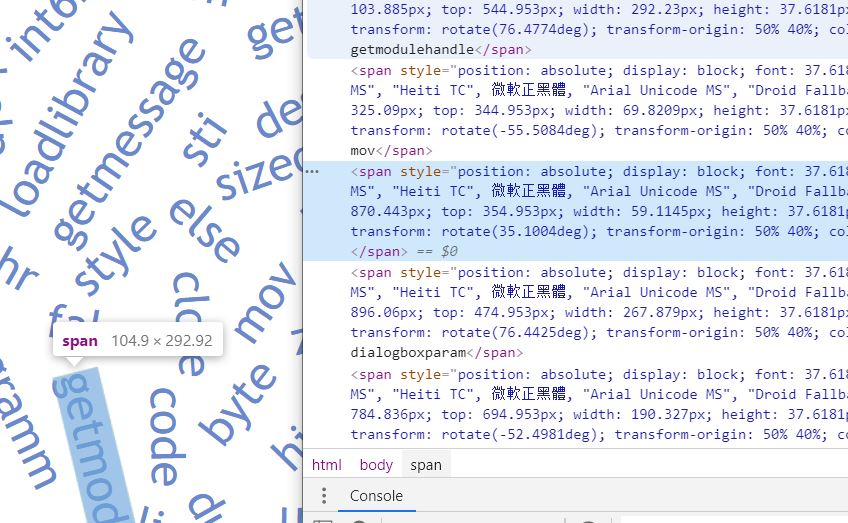

[](https://www.npmjs.com/package/github-code-cloud)

# Make a wordcloud from all of your public repositories hosted on github

Enables you to create a wordcloud from all of your public github repositories. 

**Process**:
+ Checkout all public repos
+ split up all source codes into single words
+ utilize puppeteer and wordcloud2 in order to create the wordcloud

# Usage

**Install:**
```
npm install github-code-cloud -D
```

**Code:**
```js
const cloud = require("github-code-cloud")
cloud.generateCloud("gabbersepp", process.env.GITHUB_TOKEN, ["js", "asm", "cs", "ts", "java"]);
```

# Live Example

Image:


HTML:

